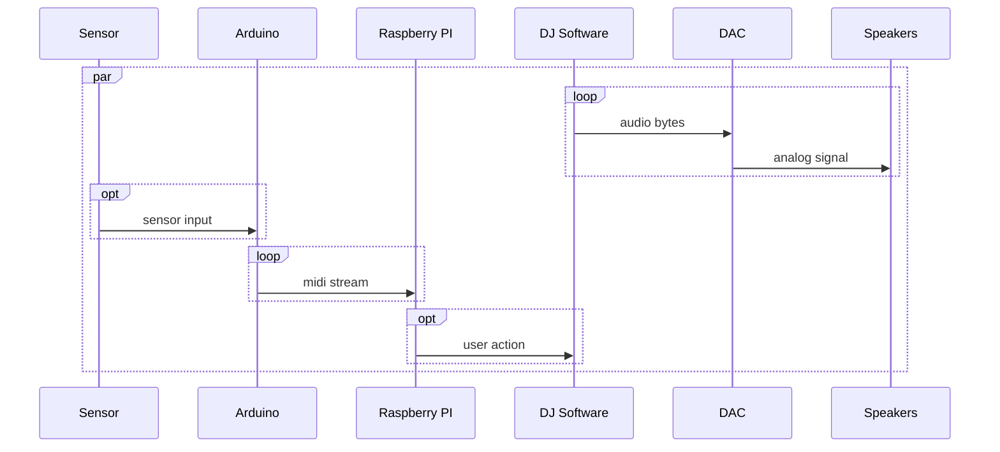
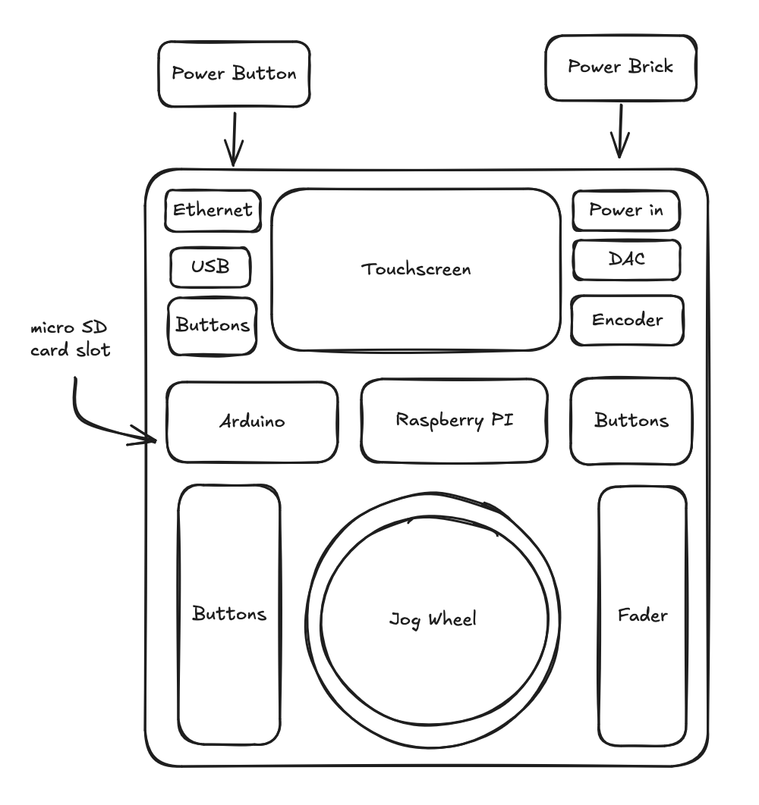

# diagrams

## Software

```mermaid
sequenceDiagram
    participant SENS as Sensor
    participant ARD as Arduino
    participant RPI as Raspberry PI
    participant DJS as DJ Software
    participant DAC as DAC
    participant SPK as Speakers
    par
        loop
            DJS->>DAC: audio bytes
            DAC->>SPK: analog signal
        end
        opt      
            SENS->>ARD: sensor input
        end
        loop
            ARD->>RPI: midi stream
        end
        opt
            RPI->>DJS: user action
        end
    end
```

## Hardware

